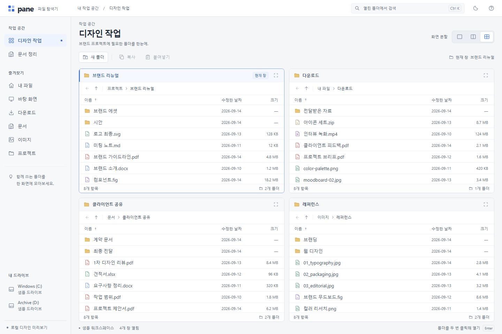
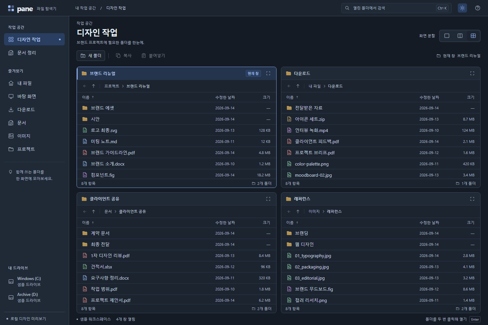

# Quadpane

여러 폴더를 한 화면에 나란히 열고, 패널 사이에서 파일을 복사·이동하는 Windows 멀티패널 파일 탐색기입니다. [Q-Dir](https://www.softwareok.com/?seite=Freeware/Q-Dir)의 멀티패널 개념을 현대적인 UI와 안전한 파일 작업으로 개선하는 것을 목표로 합니다.

- 현재 버전: `0.4.0` (Windows x64 포터블)
- 설치·관리자 권한·별도 Node.js 불필요 — 실행 파일 하나로 동작

> **English** — *Quadpane* is a multi-pane file explorer for Windows, inspired by Q-Dir. It opens up to four folder panes side by side with copy/move between panes, favorites, two workspaces, drag & drop with Windows Explorer, and full session restore. Ships as a single portable x64 executable built on Electron. Safe by design: it never overwrites or merges existing items, and delete only moves files to the Recycle Bin. Detailed docs below are in Korean.

## 화면

| 라이트 | 다크 |
| --- | --- |
|  |  |

## 주요 기능

- 1·2·4분할 패널, 현재 패널 확대, 두 작업 공간 전환과 재실행 후 상태 복원
- 드라이브·홈·바탕 화면·다운로드·문서·사진 폴더 탐색, UNC 공유 폴더 경로 지원
- 즐겨찾기·최근 경로, 주소창 펼침 목록, 열린 폴더의 항목 이름 검색과 정렬
- 패널 간 복사·이동: `Ctrl+C/X/V`, **다른 창으로** 대화상자, 드래그 앤 드롭(`Ctrl` 복사 / `Shift` 이동)
- Windows 탐색기와의 실제 파일 드래그 앤 드롭 (들어오기·`Alt` 드래그로 내보내기)
- 오른쪽 클릭 기본 메뉴: 열기, 잘라내기·복사·붙여넣기, 이름 변경(`F2`), 새 폴더(`Ctrl+Shift+N`), 삭제, 탐색기에서 보기, 파일 정보(`Alt+Enter`)
- 안전한 파일 작업: 같은 이름은 건너뜀(덮어쓰기·병합 없음), 삭제는 확인 후 휴지통으로만 이동, 영구 삭제 미제공, NTFS 추가 데이터 스트림 보존

## 포터블 실행

`npm run build:portable`로 만든 `dist-portable/quadpane-<버전>-portable-x64.exe`를 쓰기 가능한 폴더에 두고 실행합니다. 열린 폴더·작업 공간·즐겨찾기·테마는 실행 파일 옆 `quadpane-data/`에 저장되며, EXE와 함께 옮기면 설정이 유지됩니다. 자세한 사용법과 저장 구조는 [PORTABLE.md](PORTABLE.md)를 참고합니다.

## 단축키

| 단축키 | 동작 |
| --- | --- |
| `Ctrl+L` / `Ctrl+K` | 현재 주소창 선택 / 열린 폴더 검색 |
| 주소창에서 `Alt+↓` | 경로 목록 열기 |
| `Alt+←` / `Alt+↑` | 이전 폴더 / 상위 폴더 |
| `F5` | 현재 패널 새로고침 |
| `Ctrl+A` | 표시된 항목 전체 선택 |
| `Ctrl+C` / `Ctrl+X` / `Ctrl+V` | 복사 준비 / 이동 준비 / 붙여넣기 |
| `Enter` | 주소 적용 또는 폴더·기본 앱으로 파일 열기 |
| `Alt+Enter` | 파일 정보 보기 |
| `Shift+F10` / 메뉴 키 | 작업 메뉴 열기 |
| `F2` / `Ctrl+Shift+N` | 이름 변경 / 새 폴더 |
| `Delete` | 확인 후 휴지통으로 이동 |
| 드래그 중 `Ctrl` / `Shift` | 복사 / 이동 지정 |
| `Alt`를 누른 채 드래그 시작 | 다른 앱으로 파일 끌어내기 |
| `Escape` | 메뉴·대화상자 닫기, 주소 편집·검색·복사 대기 취소 |

## 개발

Node.js 24 이상과 npm이 필요합니다.

```powershell
npm ci
npm run desktop
```

| 명령 | 용도 |
| --- | --- |
| `npm start` | 루프백 웹 서버 실행 (`http://127.0.0.1:4173`) |
| `npm run desktop` | Electron 앱 개발 실행 |
| `npm run check` | 렌더러·데스크톱 JavaScript 문법 검사 |
| `npm test` | 파일 조회·복사·이동·탐색기 작업과 세션·즐겨찾기 저장 테스트 |
| `npm run build:portable` | Windows x64 포터블 EXE 생성 (`dist-portable/`) |

푸시·PR 시 [GitHub Actions](.github/workflows/windows.yml)가 Windows에서 문법 검사·테스트·포터블 빌드를 실행하고 EXE와 SHA-256 체크섬을 아티팩트로 남깁니다.

## 검증

빌드 후 별도로 준비한 Playwright 의존성 경로를 지정해 실제 앱 동작을 검증할 수 있습니다. 앱 자체에는 Playwright가 필요하지 않습니다.

```powershell
node scripts/verification/verify-real-files.cjs 'Playwright가 들어 있는 node_modules의 절대 경로'
node scripts/verification/verify-workflows.cjs 'Playwright가 들어 있는 node_modules의 절대 경로'
node scripts/verification/verify-explorer.cjs 'Playwright가 들어 있는 node_modules의 절대 경로' --mouse-drag
node scripts/verification/verify-launcher.cjs 'Playwright가 들어 있는 node_modules의 절대 경로'
```

검증 데이터와 결과는 `.checks/`에 생성됩니다(Git 추적 제외). 확인된 검증 결과와 한계는 [VERIFICATION.md](VERIFICATION.md)를 참고합니다.

## 문서

| 문서 | 내용 |
| --- | --- |
| [DESIGN.md](DESIGN.md) | 화면 구성과 인터페이스 설계 원칙 |
| [PORTABLE.md](PORTABLE.md) | 포터블 실행, 설정 저장 구조, 개발·빌드 상세 |
| [VERIFICATION.md](VERIFICATION.md) | 실행 검증 결과와 검증 범위·한계 |

## 제한 사항

- Windows 셸 확장 메뉴는 포함하지 않으며 앱 기본 메뉴를 제공합니다.
- 기존 항목 덮어쓰기·폴더 병합·영구 삭제·진행 중 작업 취소는 제공하지 않습니다.
- 현재 빌드는 코드 서명되지 않은 개발 버전입니다.

## 라이선스

[MIT](LICENSE)
